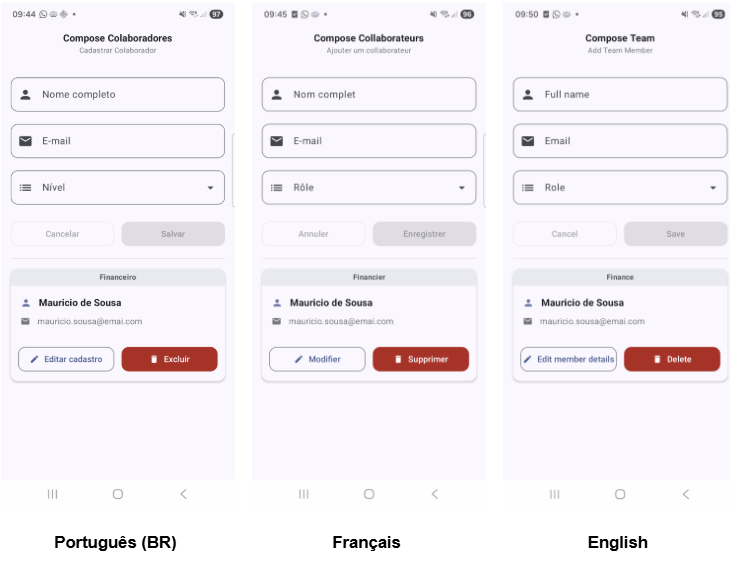

# 👥 Compose Colaboradores

[](https://github.com/julianachavespalm/composecolaboradores/actions/workflows/android.yml)

Uma aplicação Android para o gerenciamento de colaboradores, desenvolvida com **Jetpack Compose** e **Material Design 3**. O projeto demonstra a aplicação de princípios sólidos de engenharia de software, incluindo **Clean Architecture**, **MVVM** e uma suíte de testes automatizados.

---

## Funcionalidades

- **Gerenciamento Completo (CRUD):**
    - Listagem dinâmica de colaboradores.
    - Cadastro e edição com formulário reativo.
    - Exclusão com diálogo de confirmação.
- **Interface Moderna (Material 3):**
    - Cards elevados com separação visual por nível de acesso.
    - Botões de ação contextuais (Editar/Excluir).
    - Feedback visual para validações em tempo real.
- **Validações Inteligentes:**
    - Regex para validação de e-mail.
    - Bloqueio de cadastros duplicados (Nome + E-mail + Nível).
    - Impedimento de espaços em branco em campos de e-mail.
    - Habilitação dinâmica do botão de salvar apenas com dados válidos.
- **Suporte Multi-idioma (i18n):**
    - Interface totalmente traduzida para **Português**, **Inglês** e **Francês**.
    - Localização automática baseada nas configurações do sistema.
  
  

## Arquitetura e Padrões

O projeto segue os princípios da **Clean Architecture**, garantindo testabilidade e independência de frameworks:

- **Domain Layer:** Contém as entidades de negócio (`Colaborador`, `Nivel`) e a definição do contrato do repositório.
- **Data Layer:** Implementação do repositório em memória (`InMemoryColaboradorRepository`) com lógica de persistência e validação de domínio.
- **UI Layer (MVVM):** 
    - **ViewModels:** Gerenciam o estado da UI usando `StateFlow`.
    - **Composables:** UI declarativa e modularizada, utilizando *State Hoisting* para componentes reutilizáveis.

## Tecnologias Utilizadas

- **Linguagem:** [Kotlin](https://kotlinlang.org/)
- **UI:** [Jetpack Compose](https://developer.android.com/jetpack/compose) (Material 3)
- **Gerenciamento de Estado:** ViewModel e StateFlow
- **Injeção de Dependências:** Manual (focada em simplicidade para o exemplo)
- **Testes:**
    - **Unitários:** JUnit 4 para lógica de negócio e repositório.
    - **Instrumentados:** Compose Test Rule + Page Object Pattern (Uiautomator integrado).
- **CI/CD:** GitHub Actions para automação de build e testes.

## Estrutura do Projeto

```text
app/src/main/java/.../composecolaboradores/
├── data/              # Implementações de Repositório (In-memory)
├── domain/            # Regras de Negócio e Interfaces (Core)
│   ├── model/         # Entidades (Colaborador, Nivel)
│   └── repository/    # Contrato do Repositório
└── ui/                # Camada de Apresentação
    ├── components/    # Componentes de UI genéricos (Design System)
    └── gerenciador/   # Feature de Gerenciamento
        ├── components/# Componentes específicos (Card, Form, Dialog)
        ├── ColaboradorViewModel.kt
        └── GerenciadorColaboradoresScreen.kt
```

## Testes Automatizados

A qualidade do projeto é garantida por dois níveis de testes:

1.  **Testes Unitários (`test`):** Validam a lógica do repositório, garantindo que regras de IDs, duplicidade e validação de e-mail funcionem isoladamente.
2.  **Testes de UI (`androidTest`):** Utilizam o padrão **Page Object** para simular fluxos reais do usuário (Cadastrar -> Editar -> Excluir) de forma legível e manutenível.

### Como rodar:
```bash
# Testes Unitários
./gradlew test

# Testes Instrumentados (Necessário dispositivo/emulador)
./gradlew connectedAndroidTest
```

---
Desenvolvido com ❤️ por [Juliana Chaves Palm](https://github.com/julianachavespalm).
